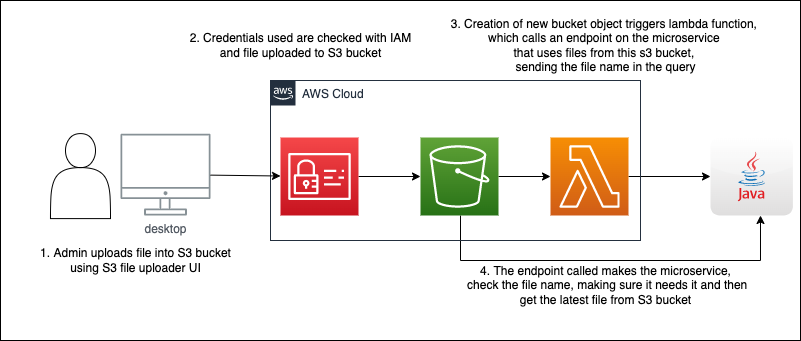

# Java S3 bucket consumer microservice

STACK: `Java 17 | Spring Boot | Maven`

- When the service is initialised, it gets the latest file from the s3 bucket specified 
and uses it to calculate a response for the marvel hero endpoint (gives a marvel hero back based on attributes provided).
- It has an endpoint that can be called to fetch new file from S3 bucket 
and this will be invoked by an AWS lambda function when new file is uploaded to S3 bucket.

## AWS usage


- [S3 bucket file uploader UI project](https://github.com/Panda4817/s3-file-uploader-ui)

### API Endpoint Example
```
curl https://s3-consumer-microservice.herokuapp.com/marvel\?attribute1\=wolf
wolverine
```


